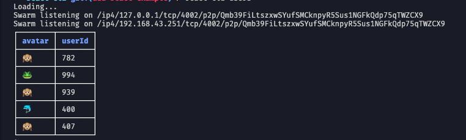

# OrbitDB React Cli

This project runs the same basic version of the vanilla-cli and vanilla-cli-latest, With the difference that runs with React CLI - to Archieve this we've used a frameworked called [Pastel](https://github.com/vadimdemedes/pastel) which allow an easy configuration for several commands (Under the hood it uses [Ink](https://github.com/vadimdemedes/ink) as base structure).

## Installation
```bash
$ yarn install
# or
$ npm install
```

## Usage
The project already configured with the basic packages, so yo just need to run the start process. First you can start and build the project using:

```
$ yarn dev
```

It gonna start waching for file changes, so you don't need to rebuild every time (It will reload automatic on each code change). In order to run command we need to run our CLI proccess, the name of the package is registered as daemon we can execute any command created inside the folder `commands`, in our case we have a command named eventlog:

```
$ yarn react-cli eventlog
```

After all you should be able to see the users log changing like this into your terminal:
